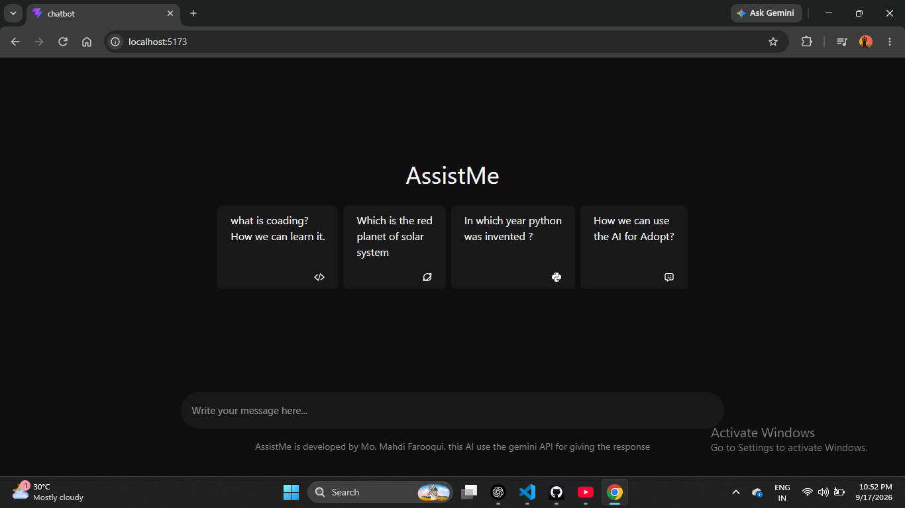

# 🤖 AssistMe – AI Chatbot

AssistMe is a modern AI-powered chatbot built with **React.js**, **Tailwind CSS**, and the **Google Gemini API**. It allows users to ask questions and receive AI-generated responses through a simple and clean chat interface.

## 🚀 Features

* 🤖 AI-powered responses using Google Gemini API
* 💬 Interactive chat interface
* 📝 User message and AI response history
* 🔄 New Chat functionality
* 📱 Responsive and modern UI
* ⚡ Fast and lightweight React application
* 🎨 Dark-themed interface using Tailwind CSS
* ⌨️ Send messages directly from the input field
* 🔐 API key stored securely using environment variables

## 🛠️ Tech Stack

### Frontend

* React.js
* JavaScript
* Tailwind CSS
* React Icons
* Vite

### AI & API

* Google Gemini API
* `@google/genai`

## 📂 Project Structure

```text
AssistMe/
│
├── public/
│
├── src/
│   ├── App.jsx
│   ├── App.css
│   ├── main.jsx
│   └── ...
│
├── .env
├── .gitignore
├── package.json
├── package-lock.json
└── README.md
```

## ⚙️ Installation & Setup

### 1. Clone the Repository

```bash
git clone https://github.com/your-username/assistme.git
```

### 2. Navigate to the Project

```bash
cd assistme
```

### 3. Install Dependencies

```bash
npm install
```

### 4. Create Environment File

Create a `.env` file in the root directory:

```env
VITE_GEMINI_API_KEY=your_gemini_api_key
```

Replace `your_gemini_api_key` with your Google Gemini API key.

### 5. Start the Development Server

```bash
npm run dev
```

The application will start on your local development server.


## 💡 How It Works

1. User enters a question in the chat input.
2. The message is sent to the `hitRequest()` function.
3. `generateResponse()` sends the message to the Google Gemini API.
4. Gemini processes the prompt and generates an AI response.
5. The user message and AI response are stored in React state.
6. The chat interface displays the conversation.


## 🎯 Future Improvements

Some features that can be added in future versions:

* 🎤 Voice input
* 🔊 AI voice responses
* 🌙 Theme customization
* 💾 Chat history with LocalStorage
* 🗑️ Delete individual conversations
* 📋 Copy AI responses
* ✨ Markdown rendering
* 📱 Better mobile responsiveness
* ⏳ Loading/typing animation
* 🔐 User authentication
* 🗄️ Database-based chat history

---

## 📸 Screenshots

Add screenshots of your application here:



---

## 🌐 Live Demo

[View Live Demo](https://chaudharysachinraj.github.io/Chatbot/)

---

## 👨‍💻 Author

**Sachin Chaudhary**

* GitHub: `@chaudharysachinraj`

---

## ⭐ Support

If you like this project, consider giving it a ⭐ on GitHub.

---

### 📄 License

This project is created for learning and educational purposes.
